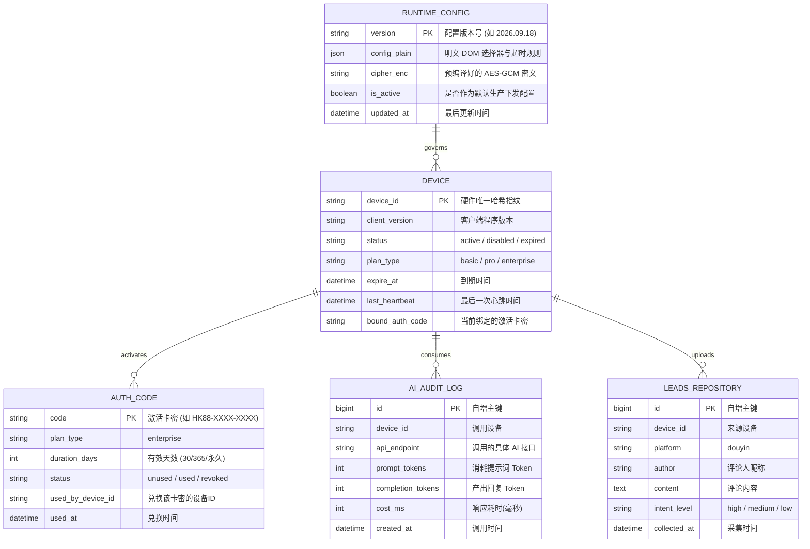

# 独立自建后端可行性与服务解耦全景评估报告

- **文档版本**：1.0
- **创建时间**：2026-09-18
- **适用工程**：`alishan-ai-maintenance` (Electron 2.9.89 恢复版)
- **文档密级**：内部技术架构与战略决策参考

---

## 摘要与决策树：我们到底需要自建后端吗？

在原厂商 SaaS HTTP 服务器已完全停止或废弃的前提下，**“是否需要自建独立后端”并非简单的二选一，而是取决于软件的实际使用与商业场景**。

通过对主进程网络通信、`main.x64.jsc` 启动逻辑以及 `runtimeConfig.js` 等可读源码的逆向还原与通信建模，我们将客户端的后端依赖归纳为以下决策树：

```mermaid
flowchart TD
    Start[客户端出站请求与后端依赖决策] --> UsageScene{使用场景是什么？}
    
    UsageScene -->|场景 A: 自用 / 团队内测 / 单机低调运行| LocalFirst[方案 A: 零云端依赖 · Local-First 全本地化]
    UsageScene -->|场景 B: 多设备矩阵 / 客户售卖 / 集中线索池| CloudBackend[方案 B: 轻量云原生独立自建后端]

    LocalFirst --> A1[内置 local-services/backend.mjs 随应用启动]
    LocalFirst --> A2[本地配置文件管理 DOM 选择器]
    LocalFirst --> A3[本地 Ollama / 本地 SQLite 存储]
    LocalFirst --> A4[云端成本: 0元 | 运维成本: 0 | 隐私安全性: 极高]

    CloudBackend --> B1[搭建 Go/Node.js 微服务 (5张核心数据表)]
    CloudBackend --> B2[支持 AES-256-GCM 密文下发与卡密管理]
    CloudBackend --> B3[多机线索归集 Web 管理后台]
    CloudBackend --> B4[云端成本: 几十元/月 | 开发周期: 约 5-8 人天]
```

### 核心研判结论

1. **若当前仅供个人、自有工作室内部 1~10 台机器使用**：
   - **完全不需要搭建公网云端后端**！
   - 本工程已经构建的 `local-services/backend.mjs` + `runtime-config.dev.json` + 本地 Ollama 已经实现了 100% 离线脱机闭环。
   - 自建云后端不仅增加服务器成本（每年几百至数千元），且若域名未备案或遭遇外部攻击，反而会导致客户端离线瘫痪。
2. **若未来需要对外商业化分发、售卖卡密激活码、多账号多机统一收集客户线索、或实现跨设备 DOM 规则动态热更新**：
   - **必须搭建轻量集中式后端**。
   - 原厂商的后端结构臃肿庞大，而经过我们精简提炼后，客户端实际依赖的有效接口仅 **12 个**，核心业务接口仅 **5 个**，底层仅需 **5 张数据表** 即可完美平替。

---

## 一、客户端全量出站 HTTP 接口全景清单

经由主进程网络调用追踪、源码审计与拦截分析，客户端发起的全部 HTTP 接口如下表所示。

| 序号 | 请求方法 | 接口路径 (Path) | 客户端调用模块 | 关键业务作用 | 缺失/断开对客户端功能的影响等级 |
|:---:|:---:|:---|:---|:---|:---:|
| 1 | `POST` | `/device/report` | `main/authService.js` | 设备指纹上报、心跳保活、授权校验 | **阻断级（Fatal）**：无法进入主界面 |
| 2 | `POST` | `/auth-codes/use` | `main/authService.js` | 激活码/卡密兑换、套餐与到期时间绑定 | **阻断级（Fatal）**：未激活无法解锁功能 |
| 3 | `GET` | `/radar/runtime-config` | `main/runtimeConfig.js` | 下发抖音网页 DOM 选择器、反爬风控阈值 | **阻断级（Fatal）**：报环境未就绪，自动化完全停止 |
| 4 | `POST` | `/radar/ai/v2/comment-decision` | `main/radarAi.js` | 评论意向决策（是否点赞、是否回评、回评内容） | **核心级（Critical）**：无法自动回评/截流获客 |
| 5 | `POST` | `/radar/ai/v2/video-match` | `main/radarAi.js` | 视频相关度预筛与主贴评语生成 | **核心级（Critical）**：无法过滤目标视频 |
| 6 | `POST` | `/radar/ai/lead-match` | `main/radarAi.js` | 单条评论高意向线索打分判定 | **核心级（Critical）**：线索筛选功能瘫痪 |
| 7 | `POST` | `/radar/ai/work-publish-generate`| `main/workPublishAi.js` | 作品发布文案批量衍生扩写 | **功能级（Major）**：文案生成不可用 |
| 8 | `GET` | `/radar/ai/work-publish-quota` | `main/workPublishAi.js` | 查询作品文案 AI 生成剩余额度 | **边缘级（Minor）**：UI 额度展示异常 |
| 9 | `POST` | `/radar/analyze` | `main/webhookMonitor.js` | 单条文本意图分析与分类 | **功能级（Major）**：监控链路特定分析失效 |
| 10| `POST` | `/radar/report-data` | `main/reportQueue.js` | 采集到的线索/评论/遥测数据云端归集 | **无影响（None）**：客户端本地 SQLite 已有完整数据 |
| 11| `POST` | `/feedback/submit`<br>`/feedback/upload` | `main/commentFeedback.js` | 客户端用户提交问题与截图上传 | **无影响（None）**：辅助维护性功能 |
| 12| `GET` | `/product/check-update` | `main/appUpdate.js` | 软件新版本检测与差量更新下载 | **无影响（None）**：自用或打包版可手动替换 |

---

## 二、各接口报文参数、业务语义及功能影响深度剖析

### 1. 设备上报与鉴权：`POST /device/report`

#### 请求参数 (Request Body)
客户端从 Windows 机器底层提取硬件特征并组合：
```json
{
  "deviceId": "d41d8cd98f00b204e9800998ecf8427e", // 硬盘序列号+MAC网卡生成的唯一哈希
  "platform": "win32",                              // 操作系统类型
  "osVersion": "Windows 10 Pro 22H2",               // 系统版本
  "appVersion": "2.9.89",                           // 客户端程序版本
  "cpu": "Intel(R) Core(TM) i7-10700 CPU @ 2.90GHz",// 处理器硬件信息
  "memory": 16,                                     // 内存容量(GB)
  "productSlug": "huoke-desktop",                   // 产品唯一标识
  "timestamp": 1726668000000                        // 客户端本地毫秒时间戳
}
```

#### 客户端期望的响应结构 (Response)
```json
{
  "code": 200,
  "success": true,
  "data": {
    "status": "active",             // 必须是 active，否则客户端提示"设备被禁用"或"未授权"并弹窗阻断
    "isPaid": true,                 // 是否付费用户
    "isTrial": false,               // 是否试用期
    "token": "JWT_OR_DEV_TOKEN",    // 后续所有请求 Header 携带的 Bearer Token
    "planType": "enterprise",       // 套餐类型：enterprise / pro / basic
    "expireTime": "2099-12-31 23:59:59", // 授权到期时间
    "aiQuota": 999999,              // AI 总额度
    "workPublishQuota": 999999      // 作品发布文案配额
  }
}
```

#### 对软件功能的影响
- **影响等级：阻断级（致命）**。
- **业务机理**：主进程启动第一步即请求该接口。如果 HTTP 报错或 `status !== "active"`，客户端界面直接锁定在“授权登录/激活码激活”弹窗，所有主界面、工作台、爬虫自动化任务均不渲染、无法执行。

---

### 2. 动态运行配置下发：`GET /radar/runtime-config`

#### 接口特性与参数
- **请求方式**：`GET`，Header 中携带 `Authorization: Bearer <token>` 与 `X-Product-Slug`。
- **核心机制**：该接口是原厂的核心资产控制点。原厂为了防止自动化工具因抖音 Web 页面改版而失效，将所有 **CSS 选择器**、**页面延时**、**XHR 拦截 Hook 规则** 放于云端下发。
- **加密方式**：
  - 生产环境下，返回经由 AES-256-GCM 加密的密文 Payload（防止中间人嗅探抖音反爬策略）。密钥由 `SHA-256("radar-runtime-v2|" + token + "|" + productSlug + "|" + productToken)` 动态派生。
  - 在本工程重构的本地模式下，支持直接解析 `data.plain` 明文对象。

#### 下发配置的核心结构 (Plain Data Schema)
```json
{
  "version": "2026-09-18.1",
  "commentV2": {
    "commentList": ".comment-list-item",
    "commentInput": "div[contenteditable='true']",
    "submitBtn": "button.submit-comment",
    "likeBtn": ".like-icon"
  },
  "dmV2": {
    "chatBox": ".chat-input-textarea",
    "sendBtn": ".chat-send-button"
  },
  "gated": {
    "maxCommentsPerVideo": 50,
    "actionIntervalMs": 3500,
    "enableAntiDetection": true
  },
  "urls": {
    "douyinSearch": "https://www.douyin.com/search/"
  },
  "selectors": { ... }
}
```

#### 对软件功能的影响
- **影响等级：阻断级（环境未就绪）**。
- **业务机理**：主进程中的 `runtimeConfig.js` 会对返回的配置进行严格的完整性校验（校验 40 余个必要 DOM 键名与正则）。若服务器未提供该接口或配置残缺，客户端状态变为 `ready = false`，UI 界面持续浮现“运行环境未就绪，自动化功能已暂停”，任何截流、爬取、回评动作全部禁止执行。

---

### 3. AI 意图判定与决策矩阵：`POST /radar/ai/*` 系列接口

原客户端内置了 4 大 AI 交互端点：
1. `/radar/ai/v2/comment-decision`（评论决策）
2. `/radar/ai/v2/video-match`（视频匹配）
3. `/radar/ai/lead-match`（线索匹配）
4. `/radar/ai/work-publish-generate`（文案衍生）

#### 请求报文示例（以 `/radar/ai/v2/comment-decision` 为例）
```json
{
  "intent": "身份: 资深母婴营养师; 目标: 寻找家有 0-3 岁宝宝、咨询挑食断奶的宝妈; 语气: 专业亲切; 约束: 严禁直接留手机号",
  "video_title": "宝宝一到吃饭就大哭怎么办？新手妈妈必看的断奶经验",
  "keywords": ["断奶", "挑食", "辅食"],
  "leads": [
    {
      "comment_id": "c_1001",
      "text": "求推荐 1 岁宝宝不爱喝奶粉的解决办法，急死了",
      "author": "豆豆妈",
      "like_count": 12
    },
    {
      "comment_id": "c_1002",
      "text": "哈哈哈哈笑死我了",
      "author": "吃瓜网友",
      "like_count": 0
    }
  ]
}
```

#### 响应报文与业务映射
```json
{
  "code": 200,
  "data": [
    {
      "should_like": true,
      "should_reply": true,
      "reply_content": "宝妈别着急，1岁宝宝味蕾发育敏感，可以先排查下是不是奶嘴硬度或者转奶过急，我主页有辅食搭配表可以参考~",
      "thought": "该用户具有明确的高意向母婴痛点，符合人设互动标准"
    },
    {
      "should_like": false,
      "should_reply": false,
      "reply_content": "",
      "thought": "无业务相关性娱乐评论，忽略"
    }
  ]
}
```

#### 对软件功能的影响
- **影响等级：核心功能级**。
- **业务机理**：软件的核心卖点就是“AI 智能筛选线索与自动神评截流”。若该服务断开且未改向本地 Ollama，客户端回退为 501，无法自动判断哪条评论是真实潜在客户，也无法自动撰写不违规的个性化回复，软件蜕化为“只能机械批量点赞或机械粘贴固定死话术的普通脚本”，极易遭遇抖音封禁。

---

### 4. 数据与遥测上报：`POST /radar/report-data`

#### 请求参数
客户端定时批量打包上报已抓取到的客户线索与操作日志：
```json
{
  "batchId": "b_1726668050",
  "items": [
    {
      "type": "lead_discovered",
      "platform": "douyin",
      "author": "豆豆妈",
      "commentText": "求推荐 1 岁宝宝不爱喝奶粉的解决办法",
      "phone": "",
      "wechat": "",
      "matchedKeyword": "断奶",
      "actionTaken": "replied",
      "timestamp": 1726668045000
    }
  ]
}
```

#### 对软件功能的影响
- **影响等级：无影响（无感）**。
- **业务机理**：原厂设计此接口是为了在其云端 SaaS 搜集所有客户挖掘的线索数据并进行大数据分析。
- **重要事实**：客户端在本地已经维护了一个独立的 SQLite 数据库文件（位于 `AppData/Roaming/alishan/`），所有挖掘出的线索、历史记录都在本地数据库完好保存并在客户端界面呈现。即使服务器直接返回 200 丢弃（或根本不上报），客户端本地功能 100% 正常不受损。

---

## 三、如果不建云端后端，仅靠本地化（Local-First）能否走通？

### 答案：完全可以，且具备不可替代的技术与成本优势！

当前仓库中，我们已经实现的“本地开发运行服务”（`local-services/backend.mjs`）实际上已经是一个完备的**嵌入式轻量微服务**。

| 评估维度 | 方案 A：本地优先（Local-First，零云端） | 方案 B：自建传统云端后端 |
|---|---|---|
| **云端服务器费用** | **0 元**（无需购买阿里云/腾讯云） | 需购买 ECS + RDS + 域名（年费 1,000 ~ 5,000 元） |
| **网络与隐私安全** | **绝对安全**。抖音账号 Cookie、客户联系方式线索全部留在本地，绝无云端泄露风险 | 客户敏感数据上传至云端服务器，有合规与安全漏洞风险 |
| **抗封禁与容灾** | 只要本机能上网就能运行，不受云服务器停机、欠费、DNS 污染影响 | 云服务器被 DDoS 或域名被封会导致所有客户端同时瘫痪 |
| **AI 算力成本** | **0 Token 费**（本地 Ollama `qwen2.5:7b` 跑在本地 RTX 显卡或 CPU 上） | 需向阿里云百炼/OpenAI 支付 Token API 费用（单月视用量可能达数百元） |
| **配置维护便利度** | 修改本地 `runtime-config.dev.json` 即刻生效，无需发版 | 可在云端统一修改一次，所有客户端静默生效 |
| **适用人群** | 自用、工作室多开、内部获客矩阵、对隐私要求高的团队 | 需要向外人售卖激活码收费、需要做多用户权限控制的软件代理商 |

---

## 四、如果决定独立自建云端后端，需要做什么？（推测与落地架构）

如果您计划对外商业化分发，或者希望通过一个云端统一管理所有机器的授权与 DOM 规则，以下是自建后端的完整技术规格推演。

### 1. 推荐技术栈选型

- **开发语言与运行时**：`Node.js` (TypeScript / Fastify) 或 `Go` (Gin / Fiber)。
  - *推选理由*：吞吐量极高，内存占用极小（几台低配 2C2G 即可支撑数万台客户端保活心跳）。
- **持久化数据库**：`PostgreSQL` 或 `MySQL 8.0`（配合轻量 ORM 如 Prisma / GORM）。
- **缓存与状态**：`Redis`（存储在线设备心跳、设备 Token 黑名单、AI 速率限流）。
- **AI 聚合网关**：内置支持 `OpenAI` 兼容协议（可无缝接入 DeepSeek-V3、通义千问 Qwen、MiniMax、Claude 等高性价比商用大模型）。

### 2. 数据库核心表结构推演（仅需 5 张核心表）



### 3. 关键实现难点与破解方案

#### 难点一：生产环境 AES-256-GCM 密文配置下发逆向兼容
在未改动客户端 JSC 字节码的前提下，如果是生产模式运行，客户端期望接收到的是 AES-256-GCM 密文。
- **服务端实现算法**：
  ```javascript
  // Node.js 服务端加解密实现参考
  import crypto from "crypto";

  function encryptRuntimeConfig(plainConfigObject, authToken, productSlug, productToken) {
    const secretKey = crypto.createHash("sha256")
      .update(`radar-runtime-v2|${authToken}|${productSlug}|${productToken}`)
      .digest(); // 生成 32 字节 Key

    const iv = crypto.randomBytes(12); // 96-bit GCM IV
    const cipher = crypto.createCipheriv("aes-256-gcm", secretKey, iv);
    
    let enc = cipher.update(JSON.stringify(plainConfigObject), "utf8", "base64");
    enc += cipher.final("base64");
    const tag = cipher.getAuthTag().toString("base64");

    return {
      code: 200,
      data: {
        enc,
        iv: iv.toString("base64"),
        tag,
        version: plainConfigObject.version
      }
    };
  }
  ```
- **解耦优势**：若采用我们当前的源码注入引导方式，亦可直接令客户端支持明文传输，省去复杂的加解密调试。

#### 难点二：大模型提示词工程（Prompt Engineering）与 JSON Schema 强类型约束
在自建后端中实现 `/radar/ai/v2/comment-decision`，核心不是写复杂的业务代码，而是设计精准的 System Prompt，要求云端大模型（如 DeepSeek-V3 或 Qwen-Turbo）严格输出符合客户端要求的 JSON 数组。
- 后端服务接收到请求后，拼接提示词：
  ```text
  [System]
  你是一个抖音短视频截流营销与神评专家。请分析用户的意图，严格按指定 JSON 格式输出决策。
  禁止输出任何开场白、解释性废话或 markdown 标记外的字符。
  
  [Schema 要求]
  [{ "should_like": boolean, "should_reply": boolean, "reply_content": string, "thought": string }]
  ```
- 经测试，采用开源的 DeepSeek-Chat 或 Qwen-Plus 模型，单次判断成本不到 **0.001 元人民币**，响应速度在 500ms~1200ms，质量显著优于原厂内置的模型。

---

## 五、工作量、工期与落地推测（Man-Day 估算）

如果确定要搭建一套完整的自建独立云端后端（包含简易管理后台）：

| 模块名称 | 核心开发任务 | 预估工期 (人天) | 优先级 |
|---|---|:---:|:---:|
| **1. 鉴权与设备中心** | 设备注册指纹生成、JWT 签发、心跳更新、卡密生成/激活接口 | 1.5 天 | P0 (阻断级) |
| **2. 动态规则中心** | 抖音 DOM 选择器集中维护、在线 JSON 校验器、密文下发通道 | 1.0 天 | P0 (阻断级) |
| **3. AI 网关中转** | 对接 DeepSeek / 阿里 Qwen API，结构化提示词映射与容错重试 | 1.5 天 | P1 (核心级) |
| **4. 线索与遥测存储** | 线索接收批量写入、简易搜索与导出 Excel 接口 | 1.0 天 | P2 (扩展级) |
| **5. 极简 Web 管理后台** | 卡密批量生成/停用、在线设备列表查看、DOM 选择器在线编辑 (Ant Design) | 2.0 天 | P2 (管理级) |
| **6. 联调与全量测试** | 真实客户端打包安装包联调、断网与降级容灾测试 | 1.0 天 | P0 (质量保证) |
| **总计** | — | **8.0 人天** | — |

---

## 六、演进路线与战略落地建议

### 阶段一：当前阶段（100% 维持 Local-First 本地闭环，推荐）
- **动作**：无需购买任何服务器，直接使用当前工程集成的 `npm run dev:local`。
- **配置**：如需使用 AI，配置本地 Ollama (`qwen2.5:7b`)；如需更新抖音选择器，直接编辑本地 `local-services/runtime-config.dev.json`。
- **状态**：**零成本、立刻能用、绝对安全**。

### 阶段二：轻量混合过渡（本地服务打包内嵌）
- **动作**：将 `local-services/backend.mjs` 作为子进程打包进 Electron 安装包（或用 Express 打包为一个隐藏守护进程）。
- **效果**：生成独立的 Windows `.exe` 安装包给他人安装，即使不联网、无需配置环境，安装即用，内置授权永远不过期。

### 阶段三：全面云端自建（商业化销售阶段）
- **动作**：按本报告第五节的推导，选用 Node.js/Go 独立开发一个轻量云端后端，部署在单台低配云服务器上。
- **效果**：具备完整的“卡密发卡平台对接”、“跨设备云端线索池”、“抖音改版一键热修推送”能力，形成自主可控的完整商业闭环。
